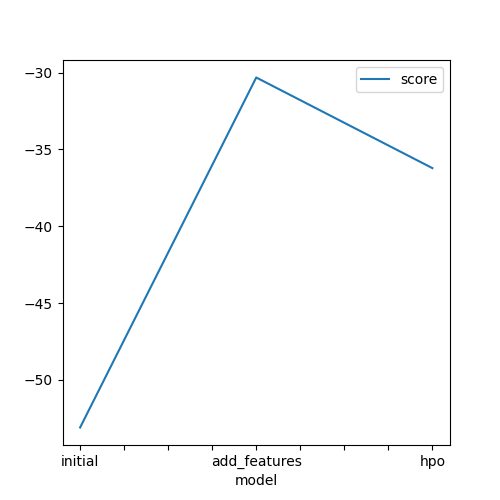
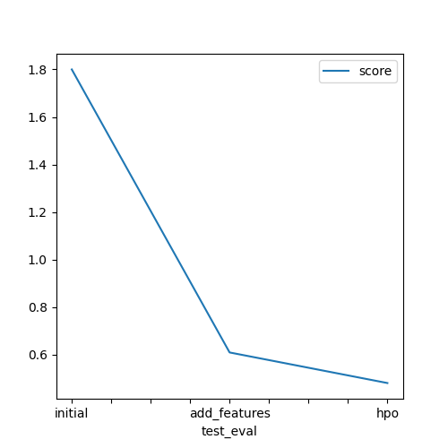

# Report: Predict Bike Sharing Demand with AutoGluon Solution
#### NAME : AYESHA NOREEN

## Initial Training
### What did you realize when you tried to submit your predictions? What changes were needed to the output of the predictor to submit your results?
I realized ,through this,  that those scores increased in the course of comparing them with other models in Kaggle.
But I was made very aware that Kaggle doesn't accept submissions containing negative values.
However, luckily, my submission had no negative value

### What was the top ranked model that performed?
WeightedEnsemble_L3 topped our leaderboard with maximum score in all 3 submissions

## Exploratory data analysis and feature creation
### What did the exploratory analysis find and how did you add additional features?
I splitted the datetime into hour, using the to_datetime().dt.hour conversion.
I also ensured that our AUTOGLUON didn't recognize the features `season` and `weather` as just integers, but into the category datatype for convinience sake by using .astype("category") method.

### How much better did your model preform after adding additional features and why do you think that is?
After applying EDA and neccessary Feature Engineering, the model performed wonderfully, the highest model score jumped from -53.099358 to -30.316108.

## Hyper parameter tuning
### How much better did your model preform after trying different hyper parameters?
The error metric actually reduced,which is a good sign. Plus, the highest model score jumped from -53.099358 to -36.214893.

### If you were given more time with this dataset, where do you think you would spend more time?
If given more time with this dataset, I'd spend my time on finding ways to avoid my model from overfitting, so as to improve it.

### Create a table with the models you ran, the hyperparameters modified, and the kaggle score.
|model|hpo1|hpo2|hpo3|score|
|--|--|--|--|--|
|initial|default|default|default|1.79993|
|add_features|default|default|default|0.60859|
|hpo|max_depth|max_features|max_samples|0.47984|

### Create a line plot showing the top model score for the three (or more) training runs during the project.

### Create a line plot showing the top kaggle score for the three (or more) prediction submissions during the project.

## Summary
This project I was been called upon to do, outlines a complete process for building and assessing a bike-sharing demand prediction model with AutoGluon. It covers essential steps like data preparation, feature engineering, hyperparameter tuning, and submission to Kaggle for evaluation.
